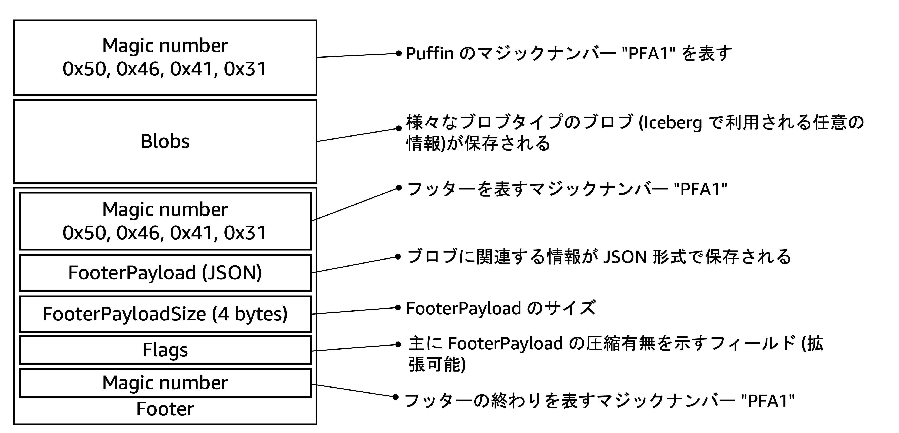

# Iceberg フォーマットバージョン 3: Deletion Vectors (削除ベクトル)

削除ベクトル（Deletion Vectors）は、Apache Iceberg フォーマットバージョン 3 で導入された新機能で、行レベルの削除情報を効率的に管理する仕組みです。この仕様はプルリクエスト [#11240](https://github.com/apache/iceberg/pull/11240) で確定しました。

削除ベクトルは、従来の**位置指定削除ファイル**と同じ情報（削除対象レコードのファイル名と行位置）を含みますが、ビットマップ形式で保存することで効率化を実現しています。また、フォーマットバージョン 3 では**位置指定削除ファイルが廃止**されることが [Table Spec](https://iceberg.apache.org/spec/#position-delete-files) に記載されています。

以下にその特徴を示しています。

* Iceberg (Java) 1.8.0 以上で利用可能[^engine]
* 削除ベクトルは、`deletion-vector-v1` ブロブタイプとして Puffin に格納される (フォーマットバージョン 2 では、Apache Parquet 形式のファイルに、削除対象のレコードを含むファイルパスと削除対象の行が保存されていた)
* 削除ベクトル自体は、[Roaring bitmaps](https://roaringbitmap.org/) を利用しビットマップ形式で保存される (Delta Lake における削除ベクトルと同様の方式)
* フォーマットバージョン 2 に比べ、生成される削除ファイルのサイズが小さく、削除ファイルの書き込み・読み込みを高速化できる

[^engine]: 2025年8月17日時点で、本書で扱うエンジン（Apache Spark、Apache Flink、Trino、Apache Hive）のうち、Apache Spark（バージョン 3.4、3.5、4.0）のみが削除ベクトルをサポートしています。

## 削除ベクトルの利用方法

削除ベクトルを利用するには、以下の 2 つの条件を満たす必要があります:

1. Iceberg テーブルのフォーマットバージョンを 3 に設定する
2. 使用するエンジンが削除ベクトルの読み書きに対応している

### テーブルフォーマットバージョンの設定

Spark SQL を使用した設定例を示します:

```sql
-- テーブル作成時にフォーマットバージョン 3 を指定
CREATE TABLE my_catalog.db.sales_iceberg (
    product_name string,
    price decimal(10, 2),
    customer_id bigint,
    order_id string,
    datetime timestamp,
    category string)
USING iceberg
TBLPROPERTIES (
    'format-version'='3',
    'write.delete.mode'='merge-on-read' -- update/delete/merge の書き込みモードを MoR にする
)

-- 既存テーブルのフォーマットバージョンを 2 から 3 に設定
ALTER TABLE my_catalog.db.sales_iceberg
SET TBLPROPERTIES ('format-version'='3')

/* フォーマットバージョン変更後の DESCRIBE EXTENDED my_catalog.db.sales_iceberg の出力結果
+-----------------------------+------------------------------------------------------------------------------------------------------------------------------------------------------+-------+
|col_name                     |data_type                                                                                                                                             |comment|
+-----------------------------+------------------------------------------------------------------------------------------------------------------------------------------------------+-------+
|product_name                 |string                                                                                                                                                |NULL   |
|price                        |decimal(10,2)                                                                                                                                         |NULL   |
|customer_id                  |bigint                                                                                                                                                |NULL   |
|order_id                     |string                                                                                                                                                |NULL   |
|datetime                     |timestamp                                                                                                                                             |NULL   |
|category                     |string                                                                                                                                                |NULL   |
|                             |                                                                                                                                                      |       |
|# Metadata Columns           |                                                                                                                                                      |       |
|_spec_id                     |int                                                                                                                                                   |       |
|_partition                   |struct<>                                                                                                                                              |       |
|_file                        |string                                                                                                                                                |       |
|_pos                         |bigint                                                                                                                                                |       |
|_deleted                     |boolean                                                                                                                                               |       |
|_row_id                      |bigint                                                                                                                                                |       |
|_last_updated_sequence_number|bigint                                                                                                                                                |       |
|                             |                                                                                                                                                      |       |
|# Detailed Table Information |                                                                                                                                                      |       |
|Name                         |my_catalog.db.sales_iceberg                                                                                                                           |       |
|Type                         |MANAGED                                                                                                                                               |       |
|Location                     |s3://amzn-s3-demo-bucket/db/sales_iceberg                                                                                                             |       |
|Provider                     |iceberg                                                                                                                                               |       |
|Owner                        |hadoop                                                                                                                                                |       |
|Table Properties             |[current-snapshot-id=7693697915902936845,format=iceberg/parquet,format-version=3,write.delete.mode=merge-on-read,write.parquet.compression-codec=zstd]|       |
+-----------------------------+------------------------------------------------------------------------------------------------------------------------------------------------------+-------+
*/
```

### 削除ベクトルの動作確認

実際に削除ベクトルがどのように動作するか確認します。まず、テストテーブルを作成し、サンプルデータを投入します：

```sql
CREATE TABLE my_catalog.db.sales_iceberg (
    product_name string,
    price decimal(10, 2),
    customer_id bigint,
    order_id string,
    datetime timestamp,
    category string)
USING iceberg
TBLPROPERTIES (
    'format-version'='3',
    'write.delete.mode'='merge-on-read'
)

INSERT INTO my_catalog.db.sales_iceberg VALUES
    ('tomato juice', 2.00, 1698, 'DRE8DLTFNX0MLCE8DLTFNX0MLC', TIMESTAMP '2023-07-18T02:20:58Z', 'drink'),
    ('cocoa', 2.00, 1652, 'DR1UNFHET81UNFHET8', TIMESTAMP '2024-08-26T11:36:48Z', 'drink'),
    ('espresso', 2.00, 1037, 'DRBFZUJWPZ9SRABFZUJWPZ9SRA', TIMESTAMP '2024-04-19T12:17:22Z', 'drink'),
    ('broccoli', 1.00, 3092, 'GRK0L8ZQK0L8ZQ', TIMESTAMP '2023-03-22T18:48:04Z', 'grocery'),
    ('nutmeg', 1.00, 3512, 'GR15U0LKA15U0LKA', TIMESTAMP '2024-02-27T15:13:31Z', 'grocery')

/* この時点におけるテーブルメタデータおよびデータファイル
s3://amzn-s3-demo-bucket/db/sales_iceberg
  | 
  |- data/
  |    |- 00000-1013-58252584-ad96-49f2-b7d1-ee5e2ebce2f0-0-00001.parquet (データファイル)
  |- metadata/
  |    |- 00000-08ab6255-a15a-46c1-8a35-e891ce3c0674.metadata.json (メタデータファイル v0)
  |    |- 00001-4b4165e5-8be5-430d-990b-bc7ce960bb4d.metadata.json (メタデータファイル v1)
  |    |- snap-6069411714608781906-1-ffad3988-a06d-42e8-b743-45c2fa71db6b.avro (マニフェストリスト v1)
  |    |- ffad3988-a06d-42e8-b743-45c2fa71db6b-m0.avro (マニフェストファイル v1)
*/
```

次に、`DELETE` 文を実行して `category='grocery'` のレコードを削除します：

```sql
DELETE FROM my_catalog.db.sales_iceberg
WHERE category = 'grocery'
```

削除操作が完了すると、削除ベクトルを含む Puffin ファイル（`00000-1015-c9a7c992-7b27-4491-a9c8-73d43ec6e1a9-00001-deletes.puffin`）が生成されます：

```
s3://amzn-s3-demo-bucket/db/sales_iceberg
  | 
  |- data/
  |    |- 00000-1013-58252584-ad96-49f2-b7d1-ee5e2ebce2f0-0-00001.parquet (データファイル)
  |    |- 00000-1015-c9a7c992-7b27-4491-a9c8-73d43ec6e1a9-00001-deletes.puffin <= 削除ベクトルを含む削除ファイル
  |- metadata/
  |    |- 00000-08ab6255-a15a-46c1-8a35-e891ce3c0674.metadata.json (メタデータファイル v0)
  |    |- 00001-4b4165e5-8be5-430d-990b-bc7ce960bb4d.metadata.json (メタデータファイル v1)
  |    |- 00002-09a9258d-908e-4146-914c-20f9efc3df76.metadata.json (メタデータファイル v2)
  |    |- snap-6069411714608781906-1-ffad3988-a06d-42e8-b743-45c2fa71db6b.avro (マニフェストリスト v1)
  |    |- snap-7693697915902936845-1-039549c9-c757-4b38-ac09-37e82dbe6ace.avro (マニフェストリスト v2)
  |    |- ffad3988-a06d-42e8-b743-45c2fa71db6b-m0.avro (マニフェストファイル v1)
  |    |- 039549c9-c757-4b38-ac09-37e82dbe6ace-m0.avro (マニフェストファイル v2)
```

> [!INFO]
> 追加の削除操作を実行すると（例：`DELETE FROM my_catalog.db.sales_iceberg WHERE product_name = 'cocoa'`）、新しい Puffin ファイルが生成されます。この新しいファイルには、既存の削除情報と新規の削除情報の両方が含まれます。

## Puffin ファイルおよび deletion-vector-v1 ブロブの内部構造

### Puffin フォーマットの構造

Puffin フォーマットは、マジックナンバー `PFA1` で始まるバイナリ形式のファイルです（詳細は [Puffin spec](https://iceberg.apache.org/puffin-spec/) を参照）。このフォーマットの **Blobs** セクションには、様々な形式のデータを格納できます。削除ベクトルは `deletion-vector-v1` ブロブタイプとして、このセクションに保存されます。



### deletion-vector-v1 ブロブの構造

`deletion-vector-v1` ブロブの内部構造を以下に示します：


各要素の詳細な仕様については、[deletion-vector-v1 blob type](https://iceberg.apache.org/puffin-spec/) を参照してください。
